# 🛒 eMarket  

**eMarket** is an e-commerce web application built with **C#**, **.NET**, and **Bootstrap**.   It utilizes **MongoDB** to manage categories, products, users, and orders, with a **RESTful API** handling communication between the frontend and backend. The demo includes a grocery dataset. Both dummy accounts use `P@ssw0rd` as the password.

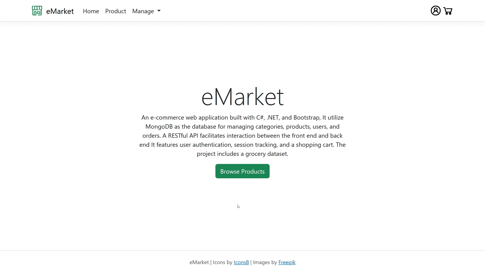  


## Table of Contents  

- [Web Pages Overview](#web-pages-overview)  
- [Tech Stack](#tech-stack)  
- [API Overview](#api-overview)  
- [Setup Instructions](#setup-instructions)  
- [NuGet Packages](#nuget-packages)  
- [Credits](#credits)  


## Web Pages Overview  

- **Home** - Landing page with a brief introduction.  
  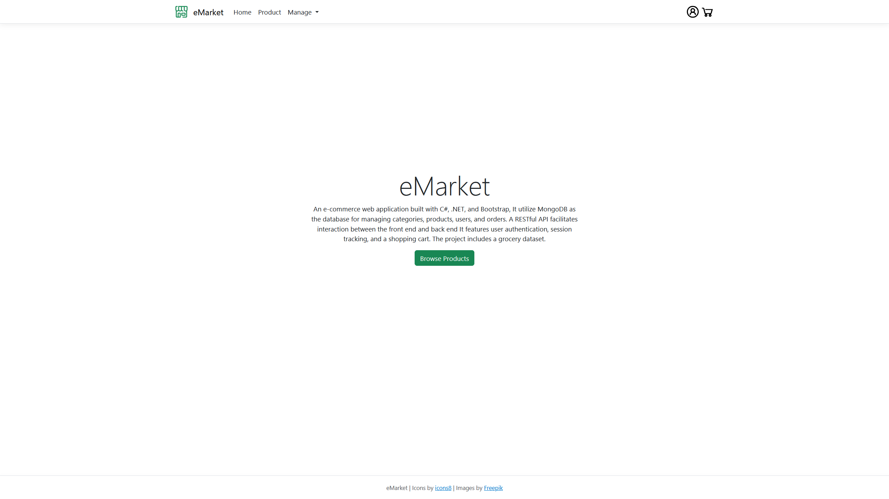  

- **Products** - Displays all available products.  
  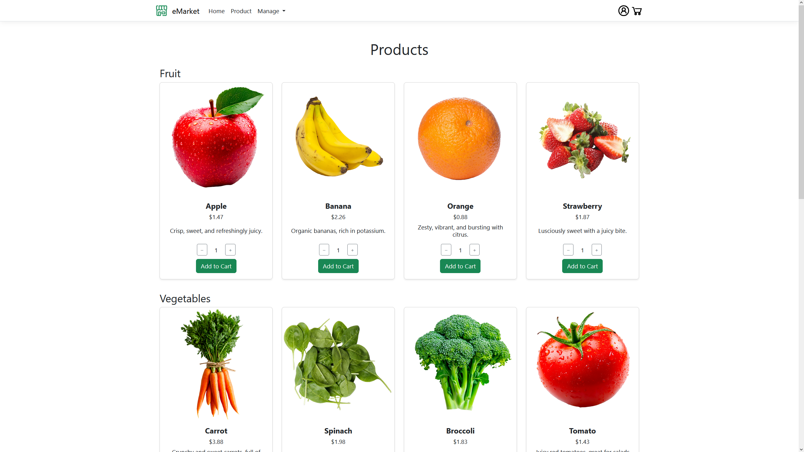  

- **Product Details** - Provides detailed information about a selected product.  
  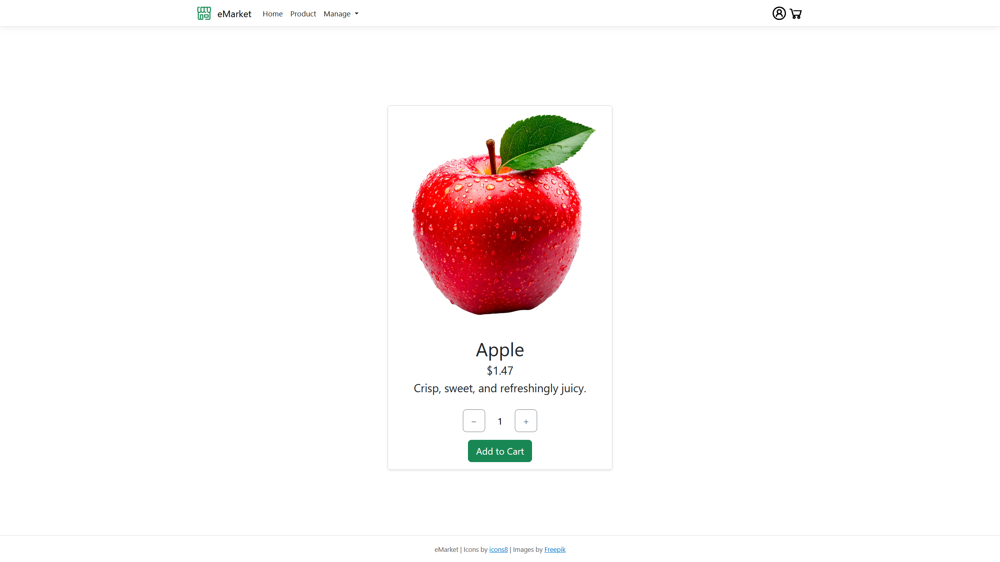  

- **Cart** - View and manage selected items before checkout. 
  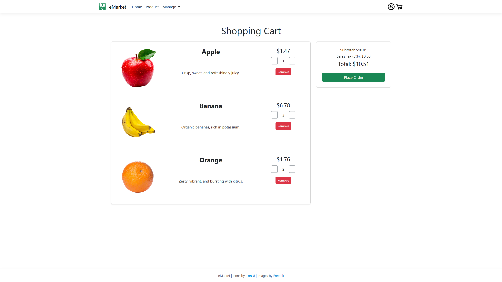  

- **Order Details** - Confirms order placement and details.  
  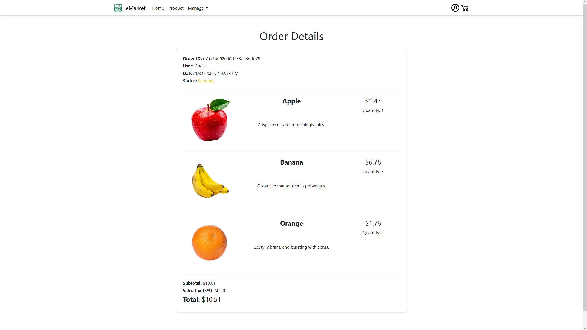  

- **Signup & Login** - Allows users to create an account and sign in.  
  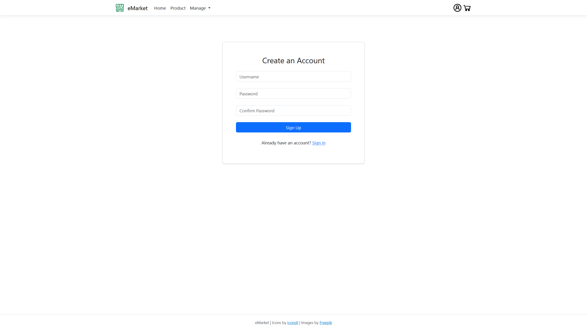  
  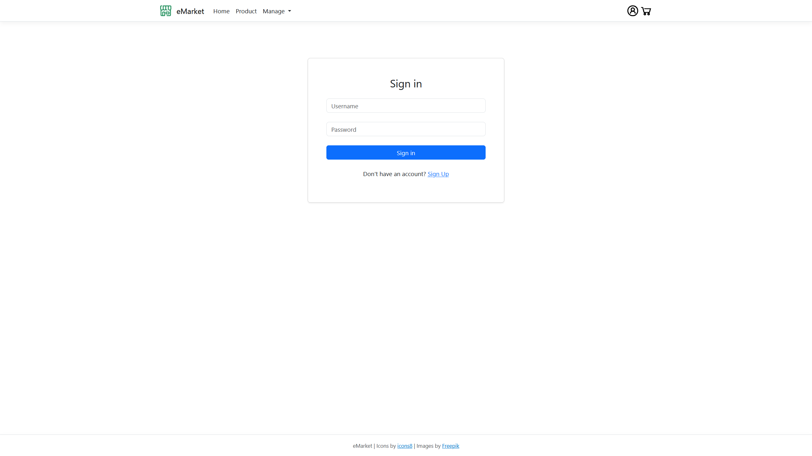  

- **Profile** - Displays and allows updates to the user's account.  
  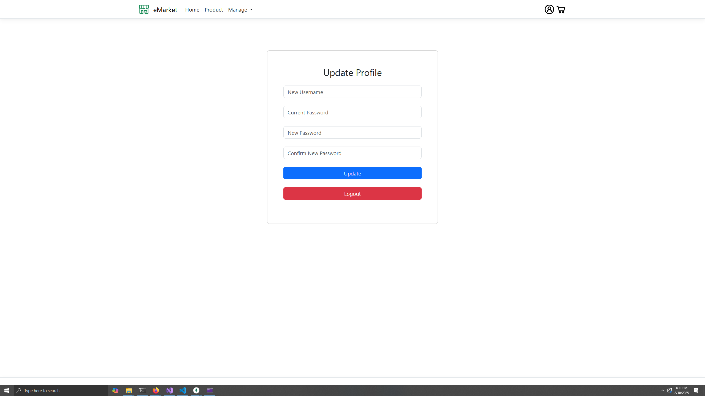  

- **Admin Management** - Provides an admin panel to manage products, categories, users, and orders.  
  - **Products**  
    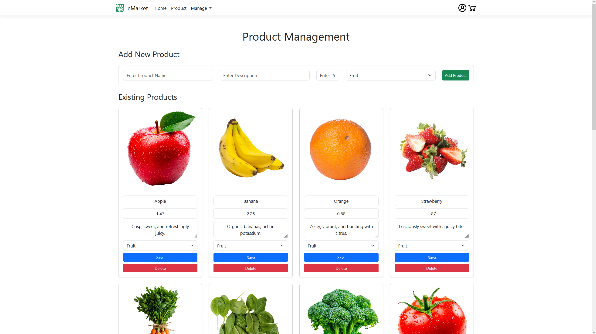  
  - **Category**  
    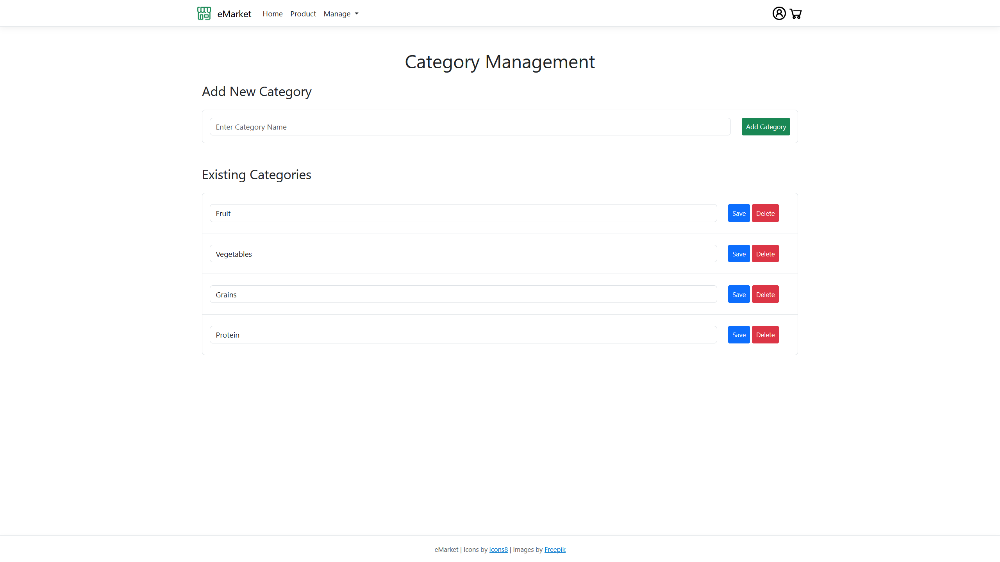  
  - **Users**  
    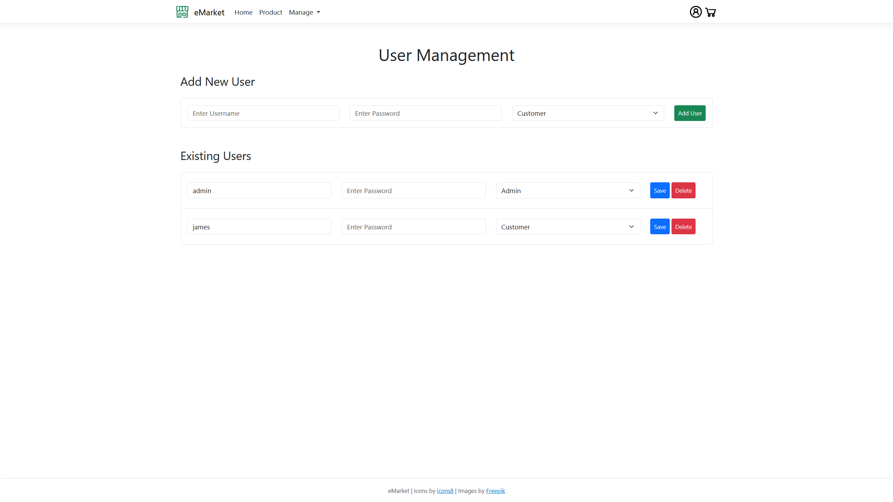  
  - **Orders**  
    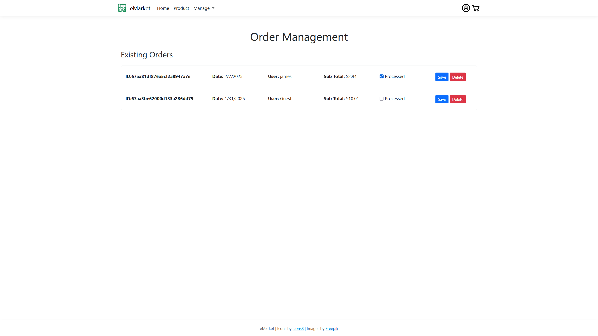  


## Tech Stack

### **Frontend**  
- **Razor Pages** - Server-side rendering.  
- **JavaScript** - API interaction.  
- **Bootstrap** - Page styling.

### **Backend**  
- **.NET Core** - Handles logic and API endpoints.  
- **MongoDB** - Database for data storage.  
- **JWT Authentication** - Secure token-based authentication.  
- **BCrypt.Net-Next** - Password hashing.  


## NuGet Packages  
- **MongoDB.Driver** - Database operations.  
- **Microsoft.Extensions.Identity.Core** - User identity management.  
- **Microsoft.AspNetCore.Authentication.JwtBearer** - JWT authentication middleware.  
- **BCrypt.Net-Next** - Password hashing.  


## API Overview  

The **RESTful API** provides CRUD functionality for:  
- **Products** (`/api/products`)  
- **Categories** (`/api/categories`)  
- **Users** (`/api/users`)  
- **Orders** (`/api/orders`)  

### **Example Endpoints**  

#### **Get All Products**  
```http
GET /api/products
```

#### **Get Product by ID**  
```http
GET /api/products/{id}
```

#### **User Authentication (Login)**  
```http
POST /api/users/login
Content-Type: application/json
{
  "username": "admin",
  "password": "P@ssw0rd"
}
```
Returns a **JWT token** on success.


## Setup Instructions  

1. **Import the grocery store demo data:**  
  ```sh
  mongorestore dump
  ```  
2. **Start the application using .NET CLI or Visual Studio:**  
  ```sh
  dotnet run
  ```  
3. **Access the application in your browser:**  
  ```
  https://localhost
  ```  


## Credits  

- **Icons**: [Icons8](https://icons8.com)  
- **Food Photos**: [Freepik](https://freepik.com)  